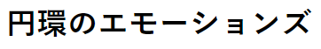
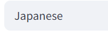
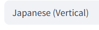

# 🖼️ Multilingual Image-to-Text Translator

This is a simple Streamlit application that provides step-by-step instructions for users to upload an image containing text in any language and extract it using OCR (Optical Character Recognition). The app supports directional language input and provides visual feedback to guide the user.

---

## 🚀 How to Use

### ✅ 1. Upload an Image
Upload an image that contains text. It can be in **any language**.



---

### 🌐 2. Select the Correct Language
Make sure you select the correct language **and** its **reading direction**. Some languages (like Japanese or Chinese) may be read from **top to bottom** or **right to left**.

| Incorrect | Correct |
|----------|---------|
|  |  |

---

### ⚖️ 3. Choose the Correct Weight
If you do not encounter an error with both weight options, try adjusting them and compare which one gives more accurate results.

---

## 📝 Notes

> ⚠️ The translator struggles with:
> - Images that are skewed or rotated
> - Backgrounds with too much noise or color
> - Low contrast between text and background

Make sure your image is clean, with clear and properly aligned text.

---

## 📦 Requirements

- Python 3.7+
- Streamlit
- Pillow (`PIL`)
- PyTesseract
- OpenCV

Install dependencies:

```bash
pip install -r requirements.txt
```
## 🏃 To run application
``` bash 
streamlit run app.py
 ```
